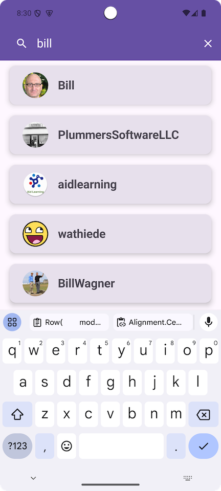

## MAD Github User Android App Demo
An updated version of my Github User Search app for Android, now built with Modern Android Architecture.
Feel free to look at the codes, pickup snippets, use it for learning materials or just to have fun searching Github users :) 

### What's new in the codes
- **Jetpack Compose** in favor of XML layouts. Combine this with **Compose Navigation**, and you truly have an single activity app now.
- Infinite scrolling with/without **Paging 3**. Checkout `UserListScreen` for Compose-Paging example, and UserSearchScreen for Compose only version.
- Bye bye LiveData, hello **Flow/StateFlow**.

## Screenshots, Screenshots...

